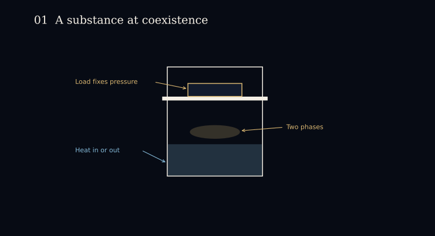
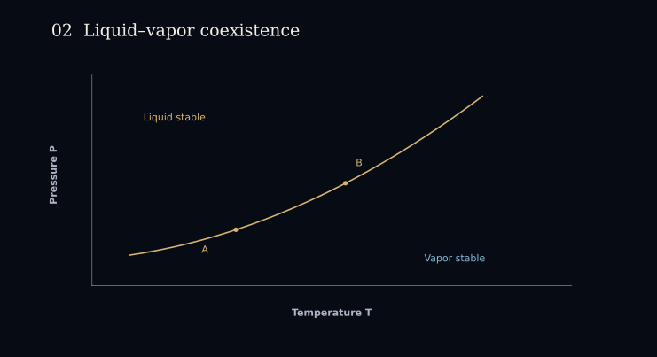
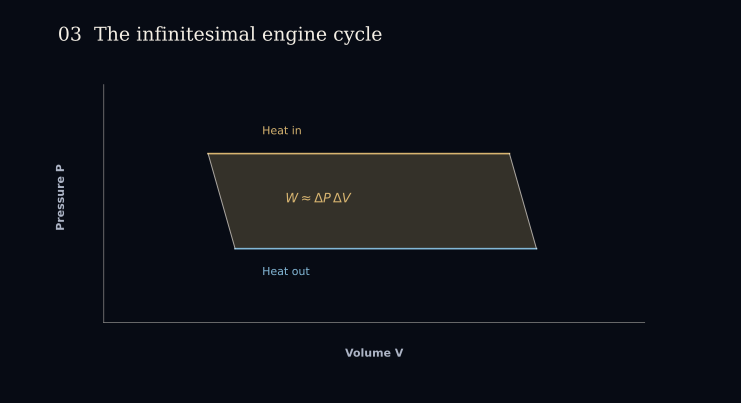
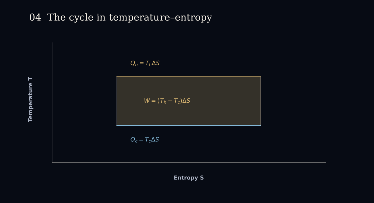
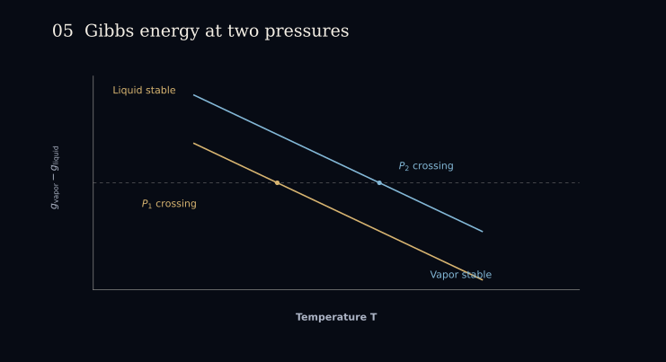
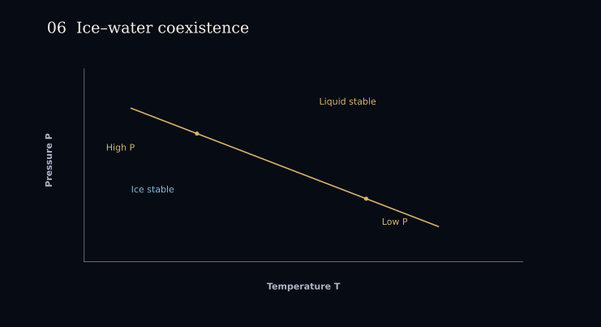
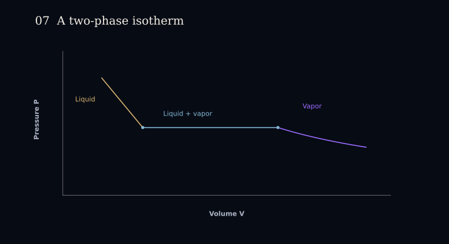

**Knowledge applied:** reversible engines, $P\,dV$ work, entropy, latent heat, Gibbs free energy.

## The setup

A fixed sample of a single substance sits under a piston, with two phases present at once. The load on the piston sets the pressure $P$; heat added or removed through the walls converts one phase into the other at constant temperature $T$.

*The load fixes the pressure, and heat exchange converts one phase into the other. While both phases are present, $P$ is pinned to the coexistence value $P_\text{coex}(T)$.*

That constraint carries the rest of this entry. A single-phase sample has two independent variables; a two-phase sample has one, since the pressure is no longer free at a given temperature.

Fix a convention: let phase 1 convert to phase 2 by absorbing latent heat $L > 0$. For the whole sample,

$$\Delta V = V_2 - V_1, \qquad \Delta S = \frac{L}{T}.$$

These are whole-sample quantities. Lowercase $v$, $s$, and $g$ below denote the corresponding per-mole quantities.

*Each point on the curve is a temperature and pressure at which both phases can coexist. Two neighboring such states differ by $dT$ and $dP$.*

## Work from a narrow cycle

Take the sample once around a closed reversible cycle between $T$ and $T + \Delta T$: convert $1 \to 2$ at the hotter temperature, cool at fixed composition, convert $2 \to 1$ at the colder temperature, and return. Each conversion leg holds both $T$ and $P$ fixed, so it is horizontal in the $P$–$V$ plane, and the two legs sit a pressure $\Delta P$ apart (the figures write this increment as $dP$).

*The net work is the enclosed area. The connecting legs are schematic, and the area result holds to leading order in $\Delta T$.*

The net work is the enclosed area, and the heat absorbed on the hot leg is the latent heat:

$$W \simeq \Delta P\,\Delta V, \qquad \eta \simeq \frac{\Delta P\,\Delta V}{L}.$$

The same cycle is a rectangle in the temperature–entropy plane, where both heat exchanges are read off directly.

*Heat enters as $Q_h = T_h\,\Delta S$ and leaves as $Q_c = T_c\,\Delta S$, so the enclosed area is the work.*

The cycle is reversible and exchanges heat only at $T_h$ and $T_c$, so its efficiency is the Carnot value $\Delta T / T$. Equating the two expressions and cancelling $L$ gives the slope of the coexistence curve:

$$\eta \simeq \frac{\Delta P\,\Delta V}{L} = \frac{\Delta T}{T}, \qquad \frac{dP_\text{coex}}{dT} = \frac{L}{T\,\Delta V} = \frac{\Delta S}{\Delta V}.$$

Two caveats about the construction. The area argument is leading order: the connecting legs contribute at second order in $\Delta T$, which is why the figure draws them schematically rather than as an exact finite Carnot cycle.

The second concerns orientation. The figure is drawn for $\Delta V > 0$, where the hot conversion is an expansion at the higher pressure. If $\Delta V < 0$, the slope is negative, so the hotter state now sits at the *lower* pressure: the hot leg runs leftward along the bottom of the diagram and the cold leg rightward along the top. The traversal remains clockwise and $W = \Delta P\,\Delta V$ remains positive, because $\Delta P$ and $\Delta V$ change sign together. The sketch is relabeled, not re-signed, and a positive-work diagram drawn for one sign of $\Delta V$ cannot be read directly as justifying the other.

## The same slope from equilibrium alone

The cycle is not the only route. At fixed composition,

$$dG = V\,dP - S\,dT,$$

which follows from $G = U - TS + PV$ together with $dU = T\,dS - P\,dV$.

Coexistence is the statement that a molecule has no preference between the phases: their molar Gibbs free energies are equal, $g_1 = g_2$. Away from the line, the phase with the lower $g$ is the stable one.

*The crossing marks coexistence, where the difference vanishes. Raising the pressure shifts the crossing to a higher temperature.*

The equality holds at every point along the line, so its differentials must agree there. Setting $dg_1 = dg_2$ and using the relation above for each phase,

$$v_1\,dP - s_1\,dT = v_2\,dP - s_2\,dT \implies \frac{dP}{dT} = \frac{s_2 - s_1}{v_2 - v_1} = \frac{\Delta s}{\Delta v}.$$

The cycle argument shows the slope is what it must be for the engine not to exceed Carnot efficiency, while this route obtains the same slope from the equilibrium condition by itself, with no process involved and with the stable phase on each side identified.

## The ice–water line slopes downward

Let phase 1 be ice and phase 2 be liquid water, so $L$ is the latent heat of fusion. Water is denser than ice, which reverses the usual sign:

$$\Delta v = v_\text{water} - v_\text{ice} < 0, \qquad \frac{dT_m}{dP} = \frac{T_m\,\Delta v}{L} < 0.$$

*Raising the pressure lowers the melting temperature. The sign of $\Delta v$ is the only input that changed.*

Every other quantity keeps the sign it had for liquid–vapor. The melting curve leans backward because the solid floats, not because the thermodynamics differs.

## What a plateau shows that a point does not

An isotherm below the critical temperature flattens across the two-phase region.

*Along the plateau, heat converts liquid to vapor at fixed pressure and temperature. The endpoints are the saturated single phases.*

The endpoints of the plateau are the saturated liquid and the saturated vapor. Interior points are mixtures, and the position along the segment fixes the vapor fraction. Adding heat at fixed $T$ moves the state along the plateau: it converts phase and leaves the pressure alone, which is what makes the conversion legs of the cycle above isobaric.

This also shows what a coexistence point withholds. The entire plateau projects onto the single point $(T, P_\text{coex}(T))$. Naming that point fixes the temperature, the pressure, and the properties of each phase, but not how much of each is present. One extensive variable, volume for instance, places the sample along the plateau.

## Relevant problems

- [2023 USAPhO A3 — The Motive Power of Ice](https://www.aapt.org/physicsteam/2023/upload/2023-USAPhO-Exam.pdf)
- [2015 USAPhO A4 — phase diagrams and a piston cycle](https://www.aapt.org/physicsteam/2015/upload/E3-2-5.pdf)
